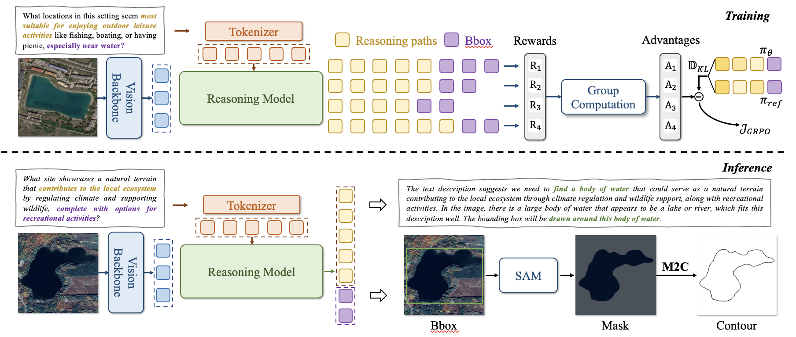

<div align="center">

# RemoteReasoner: Towards Unifying Geospatial Reasoning Workflow


[Liang Yao (姚亮)](https://1e12leon.top/) 
, &nbsp; &nbsp; 
[Fan Liu (刘凡)](https://multimodality.group/author/%E5%88%98%E5%87%A1/) ✉ 
, &nbsp; &nbsp;
Hongbo Lu (陆泓波)
, &nbsp; &nbsp;
[Chuanyi Zhang (张传一)](https://ai.hhu.edu.cn/2023/0809/c17670a264073/page.htm) 
, &nbsp; &nbsp;

[Rui Min (闵锐)]() 
, &nbsp; &nbsp;
[Shengxiang Xu (徐圣翔)](xushengxianggg.github.io) 
, &nbsp; &nbsp;
[Shimin Di (邸世民)](https://cs.seu.edu.cn/shimindi/main.htm) 
, &nbsp; &nbsp; 
[Pai Peng (彭湃)](https://scholar.google.com/citations?user=s8m-hZoAAAAJ&hl=zh-CN) 


\*  ✉ *Corresponding Author*

</div>

## News

- **2025/08/16** Welcome to RemoteReasoner. This is the first Reinforcement Learning-based reasoning framework in remote sensing.


## Introduction

Remote sensing imagery presents vast, inherently unstructured spatial data, necessitating sophisticated reasoning to interpret complex user intents and contextual relationships beyond simple recognition tasks. In this paper, we aim to construct an Earth observation workflow to handle complex queries by reasoning about spatial context and user intent. As a reasoning workflow, it should autonomously explore and construct its own inference paths, rather than being confined to predefined ground‑truth sequences.
Ideally, its architecture ought to be unified yet generalized, possessing capabilities to perform diverse reasoning tasks through one model without requiring additional fine-tuning.
Existing remote sensing approaches rely on supervised fine-tuning paradigms and task‑specific heads, limiting both autonomous reasoning and unified generalization.
To this end, we propose RemoteReasoner, a unified workflow for geospatial reasoning. The design of RemoteReasoner integrates a multi-modal large language model (MLLM) for interpreting user instructions and localizing targets, together with task transformation strategies that enable multi-granularity tasks, including object-, region-, and pixel-level. 
In contrast to existing methods, our framework is trained with reinforcement learning (RL) to endow the MLLM sufficient reasoning autonomy. 
At the inference stage, our transformation strategies enable diverse task output formats without requiring task-specific decoders or further fine-tuning. Experiments demonstrated that RemoteReasoner achieves state-of-the-art (SOTA) performance across multi-granularity reasoning tasks. Furthermore, it retains the MLLM's inherent generalization capability, demonstrating robust performance on unseen tasks and out-of-distribution categories. 


## Acknowledge


## Cite
If you find this work useful, please cite our paper as:

```
